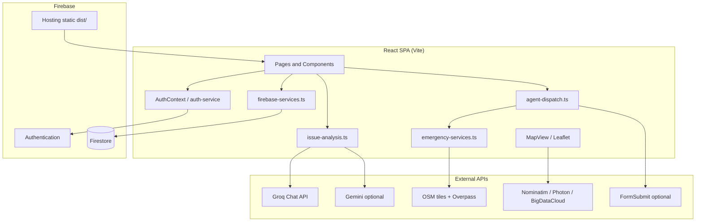
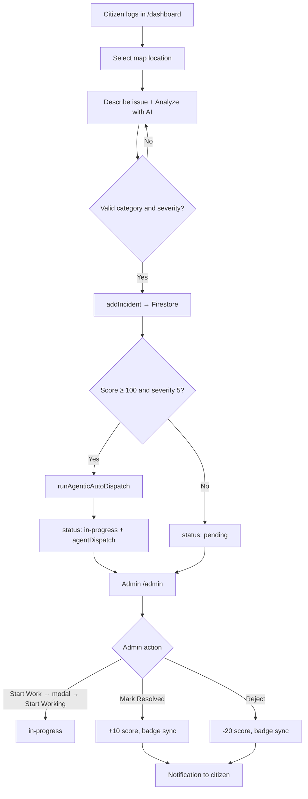

# CityWatch

[](https://react.dev/)
[](https://www.typescriptlang.org/)
[](https://vitejs.dev/)
[](https://firebase.google.com/)

**CityWatch** is a smart-city issue reporting and administration platform. Citizens report problems on an interactive map, AI classifies severity and category, and administrators triage incidents—with automated emergency escalation for trusted high-severity reports.

---

## Overview

CityWatch connects **citizens** and **city administrators** through a map-first workflow.

| Audience | Value |
|----------|-------|
| **Citizens** | Report local issues with GPS/map pins, get AI-assisted triage, track status, earn reputation badges |
| **Administrators** | Review all reports, filter by severity/status/priority, find nearest authorities, resolve or reject incidents |

**How it works:**

1. A citizen selects a location on a Leaflet map and describes an issue.
2. Groq (or optional Gemini) analyzes the text and returns category + severity (1–5).
3. The report is stored in **Cloud Firestore** (`incidents` collection).
4. Admins manage the queue; resolving or rejecting updates citizen **score** and **badges**.
5. For **Elite citizens** (score ≥ 100) reporting **severity-5** emergencies, the app runs **automated authority dispatch** (OSM lookup, optional email, phone/mailto).

There is **no custom Node/Express API server** in the deployment path. The app is a React SPA that talks to Firebase and public third-party APIs (Groq, OpenStreetMap, Nominatim).

---

## Features

### Authentication & access
- Email/password sign-up (`/signup`) and login (`/login`, `/`)
- Google sign-in via **popup** (`signInWithGooglePopup`) on Login and SignUp pages
- Redirect-based Google auth helpers exist in `AuthService` (`signInWithGoogle`, `completeGoogleRedirectSignIn`) for redirect completion in `AuthContext`
- Separate **Citizen** and **Admin** login tabs with strict role routing (wrong role → error + sign out)
- Protected routes: `/dashboard`, `/admin`, `/track` via `ProtectedRoute`
- Session-only auth persistence (`browserSessionPersistence` in `src/lib/firebase.ts`)
- Admin account creation: visit `/signup?admin=true` **while logged in as an existing admin** (`forceAdmin` flag on `AuthService.signUp`)
- `AuthService.createAdminUser()` exists for programmatic admin creation (not wired to a UI page)
- `AuthService.resetPassword()` exists (not exposed in the Login/SignUp UI)

### Citizen dashboard (`/dashboard`)
- Interactive **Leaflet** map with OpenStreetMap tiles
- Browser geolocation (`watchPosition`) + manual map click to select report location
- Severity-colored incident markers with popups
- Sidebar stat cards: active reports, total reports, high-priority count (severity ≥ 4)
- **Live Incidents** list (`IncidentsList`) with scrollable recent reports
- **Report Issue** modal (requires AI analysis before submit)
- Real-time Firestore `onSnapshot` listener for the signed-in user's incidents
- Notification bell with unread count and live updates
- Profile popup (badge, score, report stats, logout)
- **Track Reports** button → `/track`

### AI issue analysis
- **Groq** primary model: `llama-3.3-70b-versatile` with `response_format: json_object`
- **Gemini** optional fallback (`VITE_GEMINI_API_KEY`; models: env value or `gemini-2.0-flash-lite`, `gemini-2.5-flash`, `gemini-2.0-flash`)
- **Local keyword fallback** in `analyzeIssueLocally()` only when `allowLocalFallback: true` (citizen submit passes `allowLocalFallback: false`)
- Categories: Traffic, Power Outage, Water Issue, Public Unrest, Infrastructure, Health, Safety, Environmental, Other
- Severity scale 1–5 (Low → Emergency) in `src/lib/severity.ts`
- Dev-only Groq proxy: Vite forwards `/api/groq` → `api.groq.com` when `VITE_GROQ_API_KEY` is set (`vite.config.ts`)

### Reputation & gamification
- Score: **+10** when admin marks incident **resolved**, **−20** when **rejected**
- `totalReports` incremented once on incident **create** (not on accept/reject)
- Report counts synced from actual incidents via `getUserReportStats` / `syncUserReportStats`
- Badge tiers from `getBadgeFromScore()`: New, Bronze, Silver, Gold, Elite, Warning, Suspended
- Suspended citizens (score &lt; −80) blocked from submitting (`isUserSuspended`)
- Warning zone UI in profile when score is negative but above −80
- Recommended users panel for admins (`users.isRecommended === true`)

### Admin dashboard (`/admin`)
- Stat cards: total, pending, high severity (≥ 4), resolved, elite reporter count
- Recommended users cards: score, reports, accepted, rejected, open (pending + in-progress)
- Searchable/filterable incidents table:
  - **Severity** filter (1–5)
  - **Status** filter: pending, in-progress, resolved, rejected
  - **Priority** filter: Elite only, Gold+, High (Gold/Elite or severity ≥ 4)
- Reporter priority column: **HIGH** (Elite / score ≥ 100), **MEDIUM** (Gold / score ≥ 75), **NORMAL**
- Reverse-geocoded location labels via `resolveNearLocationLabel()` (`near Place (lat, lng)`)
- Table sort: active statuses first; resolved/rejected sink to bottom
- **Start Work** (pending): opens nearest-authorities modal (does not change status by itself)
- **Start Working on Incident** (in modal): sets status to `in-progress`
- **Contact Now** in modal: `tel:` dial using authority phone or emergency number
- **Copy Details** in modal: copies authority info to clipboard
- **Reject** (pending) / **Mark Resolved** (in-progress)
- **Dispatch Now** for Elite + severity-5 pending reports without prior auto-dispatch
- Auto-dispatch **backfill on page load** for eligible pending reports (silent mode—no mailto/tel popups)
- **Auto-dispatched** badge and dispatch metadata in incident detail modal
- Profile popup (shows all loaded reports for admin context)
- Incidents loaded on mount via `getAllIncidents()` (not a live `onSnapshot` listener)

### Automated emergency escalation (`src/lib/agent-dispatch.ts`)
- Triggers when: reporter score **≥ 100** AND severity **= 5** (`shouldAutoEscalate`)
- Finds nearest authority via OpenStreetMap **Overpass** (category-aware; `fast` mode with 6s timeout during dispatch)
- Falls back to **National Emergency Dispatch (112)** if Overpass times out
- India emergency numbers via `getEmergencyContacts('india')`: 100, 101, 102, 1091, 1098, 14567, 139, 1363
- Composes escalation email with incident ID, OSM map link, reporter details
- Optional FormSubmit email when `VITE_ESCALATION_EMAIL` is set
- On citizen submit (non-silent): opens `mailto:` and `tel:`
- Persists `agentDispatch` on the incident; sets status to `in-progress` when triggered

### Track reports (`/track`)
- Citizen view of own incidents (`getUserIncidents`)
- Search by description/location text
- Filter by status and AI category
- Status and severity badges

### Notifications (`notifications` collection)
- Created on: incident created, accepted, rejected, in-progress, pending, badge earned, agent auto-dispatch
- Real-time `onSnapshot` in `NotificationBell`
- Mark individual notifications as read (`markNotificationAsRead`)
- Notification types `points_earned` and `admin_recommendation` exist in the TypeScript interface but are **not** created anywhere in the current code

### Maps & geolocation
- Leaflet 1.9 with OSM raster tiles
- Circle markers: user location (purple), selected report pin (blue), incidents (severity color)
- Nominatim reverse geocoding for city name on the citizen map
- Admin labels: Photon → BigDataCloud → Nominatim (`src/lib/location-label.ts`)

### UI
- Dark-themed UI: **shadcn/ui** + **Tailwind CSS** (`components.json`, `tailwind.config.ts`)
- Responsive hook: `src/hooks/use-mobile.tsx`
- Toasts: Radix (`@/components/ui/toaster`) + Sonner
- TanStack React Query provider in `App.tsx` (no page-level queries wired yet)

---

## Tech Stack

| Category | Technologies |
|----------|----------------|
| **Frontend** | React 18.3, TypeScript 5.8, Vite 6.4, React Router 6.30 |
| **UI** | Tailwind CSS 3.4, shadcn/ui (Radix), Lucide React |
| **State** | React Context (`AuthContext`), TanStack React Query 5 |
| **Backend** | Firebase 12 (client SDK only in production deploy) |
| **Database** | Cloud Firestore |
| **Auth** | Firebase Authentication (email/password, Google) |
| **AI** | Groq (`llama-3.3-70b-versatile`), optional Gemini |
| **Maps** | Leaflet, OSM tiles, Nominatim, Photon, BigDataCloud |
| **Emergency data** | OSM Overpass API (multiple mirrors) |
| **Email (optional)** | FormSubmit.co AJAX |
| **Deploy** | Firebase Hosting + Firestore rules/indexes |
| **Tooling** | ESLint 9, `firebase-tools` 15 (devDependency) |

### Dependencies present but not central to app logic
- `recharts` — used only by `src/components/ui/chart.tsx` (shadcn primitive); no charts on pages
- `react-hook-form`, `zod`, `@hookform/resolvers` — shadcn form primitives; Login/SignUp use manual state
- `date-fns`, `cmdk`, `embla-carousel-react`, etc. — shadcn/ui ecosystem

### Legacy / not in active deploy
- `functions/index.js` — Cloud Function `analyzeIncident` on `incidents/{id}` create; uses `incident.text` (client stores `description`). **Not listed in `firebase.json` deploy targets.** Client-side `issue-analysis.ts` is the active AI path.

---

## Architecture



- All Firestore reads/writes run from the browser (authenticated).
- AI runs in the browser: Groq proxied in dev; direct API call in production build.
- No paid Google Maps API; map and authority data use free OSM services.

---

## Folder Structure

```
.
├── index.html              # Vite entry HTML
├── public/                 # favicon, robots.txt, placeholder.svg
├── src/
│   ├── assets/             # city-skyline.jpg (login background)
│   ├── components/
│   │   ├── MapView.tsx
│   │   ├── ReportIssueModal.tsx
│   │   ├── IncidentsList.tsx
│   │   ├── NotificationBell.tsx
│   │   ├── ProfilePopup.tsx
│   │   ├── ProtectedRoute.tsx
│   │   └── ui/             # shadcn components
│   ├── contexts/AuthContext.tsx
│   ├── hooks/
│   ├── lib/                # Core services (see table below)
│   ├── pages/
│   │   ├── Login.tsx
│   │   ├── SignUp.tsx
│   │   ├── Dashboard.tsx
│   │   ├── AdminDashboard.tsx
│   │   ├── TrackReports.tsx
│   │   ├── NotFound.tsx
│   │   └── Index.tsx       # Unused placeholder (not routed)
│   ├── App.tsx
│   └── main.tsx
├── functions/              # Optional Cloud Functions (not deployed via firebase.json)
├── firestore.rules
├── firestore.indexes.json
├── firebase.json
├── env.example
├── vite.config.ts
├── tailwind.config.ts
├── eslint.config.js
├── components.json
└── package.json
```

| Path | Purpose |
|------|---------|
| `src/lib/firebase-services.ts` | Incidents, users, notifications, badges, scores, dispatch persistence |
| `src/lib/issue-analysis.ts` | Groq/Gemini/local AI classification |
| `src/lib/agent-dispatch.ts` | Rule-based emergency auto-escalation |
| `src/lib/emergency-services.ts` | Overpass nearest-authority lookup |
| `src/lib/location-label.ts` | Admin reverse-geocode labels |
| `src/lib/severity.ts` | Shared severity scale and helpers |
| `src/lib/auth-service.ts` | Firebase Auth wrappers |
| `src/lib/firebase.ts` | Firebase app initialization |

---

## Installation

### Prerequisites

| Requirement | Details |
|-------------|---------|
| **Node.js** | `>= 20.0.0` (`package.json` → `engines`) |
| **npm** | Bundled with Node |
| **Firebase project** | Authentication + Firestore enabled |
| **Groq API key** | [console.groq.com/keys](https://console.groq.com/keys) — required for AI analysis as shipped |

### 1. Clone

```bash
git clone https://github.com/bhoomivijay/citywatchproject.git
cd citywatchproject
```

### 2. Install dependencies

```bash
npm install
```

### 3. Environment variables

```bash
cp env.example .env.local
```

Edit `.env.local`. **Do not commit this file** (listed in `.gitignore`).

| Variable | Required | Used in code | Description |
|----------|----------|--------------|-------------|
| `VITE_FIREBASE_API_KEY` | Yes | `src/lib/firebase.ts` | Firebase Web API key |
| `VITE_FIREBASE_AUTH_DOMAIN` | Yes | `src/lib/firebase.ts` | e.g. `your-project.firebaseapp.com` |
| `VITE_FIREBASE_PROJECT_ID` | Yes | `src/lib/firebase.ts` | Firebase project ID |
| `VITE_FIREBASE_STORAGE_BUCKET` | Yes | `src/lib/firebase.ts` | Storage bucket (Firebase Storage not used by app logic) |
| `VITE_FIREBASE_MESSAGING_SENDER_ID` | Yes | `src/lib/firebase.ts` | Firebase sender ID |
| `VITE_FIREBASE_APP_ID` | Yes | `src/lib/firebase.ts` | Firebase app ID |
| `VITE_FIREBASE_MEASUREMENT_ID` | No | `src/lib/firebase.ts` | Analytics measurement ID |
| `VITE_GROQ_API_KEY` | Yes* | `ReportIssueModal.tsx`, `vite.config.ts` | Groq key (`gsk_...`) |
| `VITE_GEMINI_API_KEY` | No | `ReportIssueModal.tsx` | Gemini fallback |
| `VITE_GEMINI_MODEL` | No | `ReportIssueModal.tsx` | Overrides default Gemini model list |
| `VITE_ESCALATION_EMAIL` | No | `agent-dispatch.ts` | FormSubmit + mailto recipient for auto-dispatch |
| `VITE_APP_ENV` | No | — | In `env.example` only; **not read by application code** |

\*Without `VITE_GROQ_API_KEY` (and without Gemini), AI analysis throws an error on analyze. Citizen submit requires successful AI analysis.

### 4. Firebase Console setup

1. [Firebase Console](https://console.firebase.google.com/) → create or select a project.
2. **Authentication** → enable **Email/Password** and **Google**.
3. **Firestore** → create a database.
4. **Project settings** → **Your apps** → register a **Web** app → copy config into `.env.local`.

### 5. Link Firebase CLI project (required for deploy)

`.firebaserc` is gitignored. After clone, run once:

```bash
npm run firebase -- login
npm run firebase -- use --add
```

Select your Firebase project when prompted.

---

## Running the Project

All commands are from `package.json` scripts:

| Command | What it runs |
|---------|----------------|
| `npm run dev` | `vite` — dev server at **http://localhost:8080** (`vite.config.ts` `server.port`) |
| `npm run build` | `vite build` — output to `dist/` |
| `npm run build:dev` | `vite build --mode development` |
| `npm run preview` | `vite preview` — serves the production build locally |
| `npm run lint` | `eslint .` |
| `npm run firebase` | `firebase` CLI (via local `firebase-tools`) |
| `npm run deploy` | `npm run build && firebase deploy --only hosting,firestore:rules,firestore:indexes` |

**Development:**

```bash
npm run dev
```

Open **http://localhost:8080**. Restart the dev server after editing `.env.local`.

**Production build (verified):**

```bash
npm run build
```

**Preview build:**

```bash
npm run preview
```

---

## Firebase Setup

### Authentication

- Providers: Email/Password, Google
- User profile document: `users/{uid}` with `role: 'user' | 'admin'`
- Admin check: `AuthService.isAdmin(uid)` reads `users.role`
- On first auth, `AuthContext` ensures a profile with `score: 0`, `badge: '👤 New Citizen'`, counters at 0

### Firestore collections

| Collection | Purpose | Key fields |
|------------|---------|------------|
| `users` | Profiles & reputation | `role`, `score`, `badge`, `totalReports`, `acceptedReports`, `rejectedReports`, `isRecommended` |
| `incidents` | Reports | `userId`, `userEmail`, `userName`, `description`, `location`, `aiAnalysis`, `severity`, `status`, `priority`, `agentDispatch` |
| `notifications` | Alerts | `userId`, `type`, `title`, `message`, `isRead`, `createdAt`, optional `incidentId` |

### Hosting (`firebase.json`)

- Serves `dist/`
- SPA rewrite: all routes → `/index.html`
- Headers: `Cross-Origin-Opener-Policy: same-origin-allow-popups` (Google popup auth)

### Security rules (`firestore.rules`)

Deploy after any rule change:

```bash
npm run firebase -- deploy --only firestore:rules
```

| Rule | Behavior |
|------|----------|
| `incidents` read/create | Any signed-in user |
| `incidents` update | Incident owner (`userId == auth.uid`) or admin (`users/{uid}.role == 'admin'`) |
| `users` | Owner or admin |
| `notifications` | Any signed-in user read/write |
| `/{document=**}` catch-all | Any signed-in user read/write |

Review the catch-all rule before a public production launch.

### Indexes (`firestore.indexes.json`)

| Collection | Fields |
|------------|--------|
| `incidents` | `userId` ASC, `createdAt` DESC |
| `notifications` | `userId` ASC, `createdAt` DESC, `__name__` DESC |

Deploy:

```bash
npm run firebase -- deploy --only firestore:indexes
```

If a query fails with `failed-precondition`, use the index-creation link in the browser console or deploy the indexes file above.

### Creating an admin user

1. **Recommended:** Log in as an existing admin → open `/signup?admin=true` → create the new admin account.
2. **Manual:** In Firestore, set `users/{uid}.role` to `'admin'`.
3. **Code:** Call `AuthService.createAdminUser(email, password, displayName)` from a script or console (not exposed in the UI).

---

## AI Integration

### Models (`src/lib/issue-analysis.ts`)

| Provider | Model | When |
|----------|-------|------|
| Groq | `llama-3.3-70b-versatile` | First choice |
| Gemini | `VITE_GEMINI_MODEL` or built-in fallbacks | If Groq fails |
| Local keywords | `analyzeIssueLocally()` | Only if `allowLocalFallback: true` |

### Prompt

System prompt names the assistant **PulseAI** and requires JSON:

```json
{"summary":"...","category":"Traffic","severity":3}
```

Uses `SEVERITY_AI_PROMPT` from `severity.ts` and a fixed category list.

### Citizen flow (`ReportIssueModal.tsx`)

1. User describes issue and clicks **Analyze with AI** → `analyzeIssue(description, { groqApiKey, geminiApiKey, geminiModel, allowLocalFallback: false })`
2. UI shows summary, category, severity
3. Submit calls `addIncident()` — blocked without valid AI fields
4. If Elite + severity 5 → `runAgenticAutoDispatch()` after modal closes

### Failure behavior

- Missing keys → error with setup instructions
- Groq error → tries Gemini models (retries on 429/quota errors)
- All cloud providers fail → throws (no silent local fallback on citizen path)

### API key exposure

- **Dev:** Groq proxied through Vite (`/api/groq`) with server-side `Authorization` header
- **Production:** Browser calls `https://api.groq.com/openai/v1/chat/completions` directly; `VITE_GROQ_API_KEY` is embedded in the bundle

---

## Maps

| Concern | Implementation |
|---------|----------------|
| Library | Leaflet (`src/components/MapView.tsx`) |
| Tiles | `https://{s}.tile.openstreetmap.org/{z}/{x}/{y}.png` |
| Default center | India `20.5937, 78.9629` until geolocation resolves |
| User location | `navigator.geolocation.watchPosition` |
| Report location | Map click or first GPS fix (auto-selected) |
| Incident markers | `L.circleMarker` colored via `getSeverityHex()` |
| Stored shape | `{ lat: number, lng: number, address?: string }` on each incident |
| Citizen geocoding | Nominatim reverse (city label in dashboard header) |
| Admin geocoding | `resolveNearLocationLabel()` — Photon, then BigDataCloud, then Nominatim |

---

## Project Workflow



### Reputation

| Event | Score |
|-------|-------|
| Incident resolved (accepted) | +10 |
| Incident rejected | −20 |

| Score | Badge |
|-------|-------|
| ≥ 100 | 🏆 Elite Citizen |
| ≥ 75 | ⭐ Gold Citizen |
| ≥ 50 | 🥉 Silver Citizen |
| ≥ 25 | 🥉 Bronze Citizen |
| ≥ 0 | 👤 New Citizen |
| −80 to −1 | ⚠️ Warning Citizen |
| &lt; −80 | 🚫 Suspended Citizen |

---

## Routes

| Path | Page | Access |
|------|------|--------|
| `/`, `/login` | `Login.tsx` | Public |
| `/signup` | `SignUp.tsx` | Public (`?admin=true` requires admin session) |
| `/dashboard` | `Dashboard.tsx` | Authenticated citizen |
| `/admin` | `AdminDashboard.tsx` | Authenticated admin |
| `/track` | `TrackReports.tsx` | Authenticated citizen |
| `*` | `NotFound.tsx` | Public |

---

## Deployment

### One-command deploy

```bash
npm run deploy
```

Equivalent to:

```bash
npm run build
firebase deploy --only hosting,firestore:rules,firestore:indexes
```

### First-time setup

```bash
npm install
npm run firebase -- login
npm run firebase -- use --add
```

### Production environment variables

`VITE_*` variables are inlined at **build time**. Set them in your shell or CI before `npm run build` / `npm run deploy`. Firebase Hosting serves static files only—there is no server-side `.env` at runtime.

### Post-deploy checklist

- [ ] `firestore:rules` deployed
- [ ] `firestore:indexes` deployed
- [ ] Auth providers enabled in Firebase Console
- [ ] `VITE_GROQ_API_KEY` available during build
- [ ] Optional: `VITE_ESCALATION_EMAIL` for auto-dispatch inbox
- [ ] Google OAuth authorized domains include your hosting domain

---

## Security

| Area | Details |
|------|---------|
| Authentication | Firebase Auth; `browserSessionPersistence` |
| Authorization | `ProtectedRoute`; `users.role` for admin |
| Login isolation | Citizen tab rejects admin accounts; admin tab rejects citizens |
| Firestore rules | Owner or admin can update incidents; deploy rules after changes |
| API keys | All `VITE_*` keys visible in client bundle |
| Suspended users | Cannot open/submit reports when `score < -80` |

---

## Future Improvements

Based on the current codebase:

- [ ] LLM tool-use agent loop (plan → execute tools) instead of fixed dispatch rules
- [ ] Server-side Groq proxy / Cloud Functions for AI and dispatch
- [ ] Firebase Cloud Messaging push notifications
- [ ] Photo attachments (Firebase Storage is configured in env but unused)
- [ ] Wire `points_earned` / `admin_recommendation` notification types
- [ ] Password reset UI using existing `AuthService.resetPassword()`
- [ ] Analytics charts using existing `recharts` shadcn primitive
- [ ] Deploy/fix `functions/index.js` to use `description` field
- [ ] Tighten Firestore catch-all rule for production
- [ ] Duplicate/nearby report detection (geohash)
- [ ] Real-time admin dashboard via `onSnapshot`

---

## Contributing

1. Fork the repository
2. Create a branch: `git checkout -b feature/my-change`
3. Make changes
4. Run `npm run build` (and `npm run lint` — note existing lint findings in the repo)
5. Open a pull request

Do not commit `.env.local`, API keys, or Firebase service account JSON.

---

## License

No `LICENSE` file is included in this repository yet. Add one (e.g. MIT) before distributing.

---

## Contact

| Channel | Link |
|---------|------|
| **GitHub** | [github.com/bhoomivijay/citywatchproject](https://github.com/bhoomivijay/citywatchproject) |

No author email or LinkedIn URL is defined in the repository.

---

<p align="center">
  Built with React, Firebase, Groq, and OpenStreetMap — no paid map API required.
</p>
